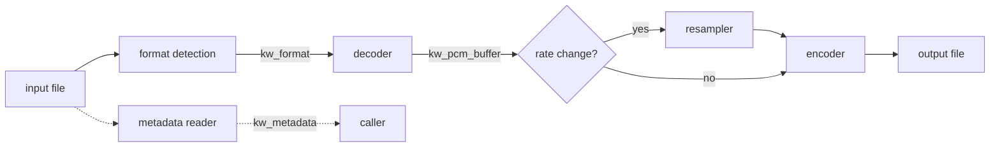

# KuantorWave Core Architecture

Status: Phase 1 design (issue #5, part of the #1 breakdown).
Public API contract: [`include/kuantorwave.h`](../include/kuantorwave.h).
Python binding decision: [ADR-0001](decisions/0001-python-binding-mechanism.md).

## Overview

KuantorWave is a compiled shared library (`.so` / `.dll` / `.dylib`) that converts
audio between M4A/AAC, MP3, and WAV. All decoding, encoding, resampling, and
metadata work happens inside the binary; Python (repo `kuantorwave_cli`) is a thin
orchestration layer that calls the C API and never touches codec internals.

The core's pivot format is the **PCM buffer**: every decoder produces one, every
encoder consumes one. No codec talks to another codec directly.

## Data flow



`kw_convert()` runs the full left-to-right path. `kw_decode()` / `kw_encode()` /
`kw_resample()` expose the individual stages; `kw_get_metadata()` reads headers
only and never decodes.

## Modules

| Module | Directory | Responsibility | Issue |
|---|---|---|---|
| Format detection | `core/src/detect/` | Map magic bytes/headers to `kw_format`; no decoding | #6 |
| PCM buffer | `core/src/pcm/` | `kw_pcm_buffer` lifecycle: alloc, free, copy; interleaving convention | #7 |
| Decoder | `core/src/decoder/` | MP3, AAC/M4A, WAV → PCM; dispatch on `kw_format` | #8 |
| Encoder | `core/src/encoder/` | PCM → MP3, AAC/M4A; bitrate/rate parameters | #9 |
| Resampler | `core/src/resampler/` | Sample-rate conversion on PCM buffers (44.1 ↔ 48 kHz first) | #10 |
| Metadata | `core/src/meta/` | Header-only extraction of duration/bitrate/rate/channels | #11 |
| Engine | `core/src/engine/` | `kw_load_engine`/`kw_unload_engine`, dispatch, error strings, versioning | #5 |

Repository layout:

```
core/
  src/
    detect/  pcm/  decoder/  encoder/  resampler/  meta/  engine/
include/
  kuantorwave.h        <- the only public header
build/                 <- out-of-tree build output, not committed
docs/
  architecture.md
  decisions/
tests/                 <- module unit tests (regression suite lives in kw_tests)
```

Module boundaries are enforced by headers: only `include/kuantorwave.h` is
public; each module exposes an internal header consumed by `engine/`, and
modules other than the engine do not include each other's headers — the sole
exception is that everything may include `pcm/`'s internal header, because the
PCM buffer is the shared currency.

## API surface

The complete public surface is the eleven functions in `kuantorwave.h`:
lifecycle (`kw_load_engine`, `kw_unload_engine`, `kw_version`, `kw_abi_version`),
operations (`kw_detect_format`, `kw_decode`, `kw_encode`, `kw_convert`,
`kw_get_metadata`, `kw_resample`), and memory/errors (`kw_pcm_alloc`,
`kw_pcm_free`, `kw_error_message`).

Contract rules (also documented in the header):

- **C ABI only.** No structs by value across the boundary, no C++ types.
- **Every operation returns `kw_result`**; results travel via out-parameters.
- **Ownership:** any `kw_pcm_buffer` the core hands out is released with
  `kw_pcm_free()`, never `free()`. The core never retains pointers the caller
  passed in after the call returns.
- **ABI versioning:** `kw_abi_version()` lets the Python wrapper refuse to run
  against a mismatched binary. `KW_ABI_VERSION` increments on any breaking
  header change.

## Error handling

- One flat `kw_result` enum; `kw_error_message()` maps codes to static strings.
- Unknown input is distinguished from known-but-unsupported input
  (`KW_ERR_UNKNOWN_FORMAT` vs `KW_ERR_UNSUPPORTED_FORMAT`) so the CLI can give
  actionable messages.
- Corrupted streams must fail with `KW_ERR_CORRUPTED` — never crash, never
  write a partial output file that looks valid (encoders write to a temp file
  and rename on success).
- The core never prints to stdout/stderr; reporting is the caller's job.

## Binary/Python boundary

Per [ADR-0001](decisions/0001-python-binding-mechanism.md) the wrapper uses
**ctypes** against the C ABI above. Consequences for the core:

- The shared library must export unmangled C symbols (`extern "C"` guard in the
  header, `KW_API` export macro).
- Strings are UTF-8 `const char*`; paths are passed as UTF-8 and converted to
  the platform encoding inside the core (on Windows: UTF-8 → UTF-16 for file
  APIs).
- The wrapper (kuantorwave_cli#1) mirrors `kw_result` into Python exceptions.

## Threading model (Phase 1)

`kw_load_engine()` is idempotent but not thread-safe; call it once before
concurrent use. After loading, operations on distinct files/buffers are safe to
run from multiple threads; sharing one `kw_pcm_buffer` across threads requires
external synchronisation. Nothing in the API contract prevents a stricter or
looser model later — revisit when a real use case appears.

## Out of scope for Phase 1

Streaming/chunked decode, channel-count conversion (mono↔stereo), tag/artwork
preservation beyond the `kw_metadata` fields, and codecs other than MP3/AAC/WAV.
The API shapes (`kw_pcm_buffer`, out-parameter style) were chosen so these can
be added without breaking the ABI.
